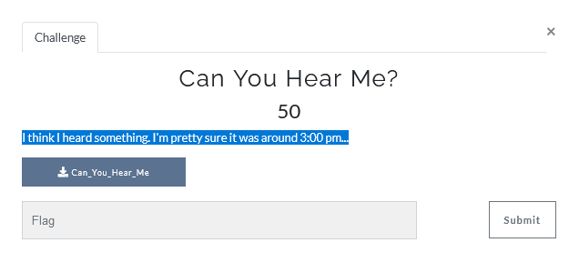
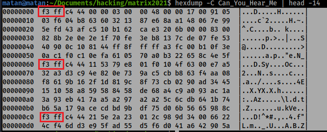
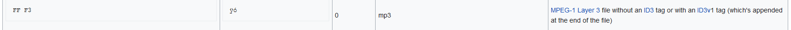

# Can You Hear Me?




Lets check the file type:
```console
matan@matan:~/Documents/hacking/matrix2021$ file Can_You_Hear_Me 
Can_You_Hear_Me: data
```
I tried to open it but the data was binary so lets check the strings:
```console
matan@matan:~/Documents/hacking/matrix2021$ strings Can_You_Hear_Me
D!^*#
eN20
7vN4
.
.
.
eYvX
ALEM.301
ALEM.3
1$00
ALEM.3
```
The string ALEM.3 looks a bit suspicions, lets remember it.

I check the hex dump of the file and look for some patterns:



We can see `F3 FF`, maybe it's a magic number?


After searching for similar magic number I found that mp3 Magic number looks similar but the bytes are swapped... strange right?!




Lets compare this file to another mp3 file - compare the strings

#####  LAME3.  -> original mp3
#####  ALEM.3 - challenge file

We can see that every 2 bytes are swapped so lets write a small script that swaps the bytes:
```python
#!/usr/bin/env python3
with open("Can_You_Hear_Me", 'rb') as fr:
    # with open()
    with open("sound.mp3", 'wb') as fw:
        while True:
                b1 = fr.read(1)
                b2 = fr.read(1)
                if b1 or b2:
                    fw.write(b2 + b1)
                else:
                    break
```

Check file type:
```console
matan@matan:~/Documents/hacking/matrix2021$ file sound.mp3 
sound.mp3: MPEG ADTS, layer III, v2,  32 kbps, 24 kHz, Monaural
```

Play this mp3 file and the flag is there :-)


