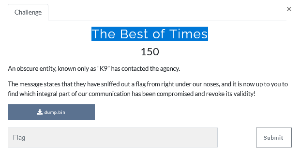

#  The Best of Times



checks file type:
```console
matan@matan:~/Documents/hacking/matrix2021$
file dump.bin 
dump.bin: ASCII text
```
Checks the data:
```console
matan@matan:~/Documents/hacking/matrix2021$ head dump.bin 
45 00 00 4a 31 0e 40 00 40 11 a9 bc c0 a8 ef 84
c0 a8 ef 02 45 00 00 5a af 89 00 00 80 11 2b 31
c0 a8 ef 02 c0 a8 ef 84 45 00 00 47 b0 9d 00 00
80 06 c9 66 34 23 dc 5c c0 a8 ef 84 45 00 00 28
aa 31 40 00 40 06 cf f1 c0 a8 ef 84 34 23 dc 5c
```
look like we have hex numbers ,so we can convert the file ,there are two options
1.cyberchef
2.python script
```python
with open("dump.bin", 'r') as f:
    with open("best_of_time.bin", 'wb') as fw:
        while True:
            tmp_data = f.readline().strip()
            if tmp_data:
                data = "".join(tmp_data.split(" "))
                fw.write(bytes.fromhex(data))
            else:
                break
```

We can see a pattern  45 00 every 20 bytes


Lets arrange the bytes in groups of 20 bytes:
```
cat best_of_time.bin | xxd -g 1 -c 20 |head
00000000: 45 00 00 4a 31 0e 40 00 40 11 a9 bc c0 a8 ef 84 c0 a8 ef 02  E..J1.@.@...........
00000014: 45 00 00 5a af 89 00 00 80 11 2b 31 c0 a8 ef 02 c0 a8 ef 84  E..Z......+1........
00000028: 45 00 00 47 b0 9d 00 00 80 06 c9 66 34 23 dc 5c c0 a8 ef 84  E..G.......f4#.\....
0000003c: 45 00 00 28 aa 31 40 00 40 06 cf f1 c0 a8 ef 84 34 23 dc 5c  E..(.1@.@.......4#.\
00000050: 45 00 00 4b aa 32 40 00 40 06 cf cd c0 a8 ef 84 34 23 dc 5c  E..K.2@.@.......4#.\
00000064: 45 00 00 28 b0 9e 00 00 80 06 c9 84 34 23 dc 5c c0 a8 ef 84  E..(........4#.\....
```
Sort the groups by the 4th byte for example:
1. 45 00 00  **4a**
2. 45 00 00  **5a**
3. 45 00 00  **1c**

I notice that this row
`00002968: 45 00 00 1c 00 01 00 00 7d 11 ec 9f 1b 04 14 12 0e 07 14 14  E.......}...........`
 has suspicious char  `{`
 So i tried to filter only rows with "45 00 00 1c"  and i got the flag
 

