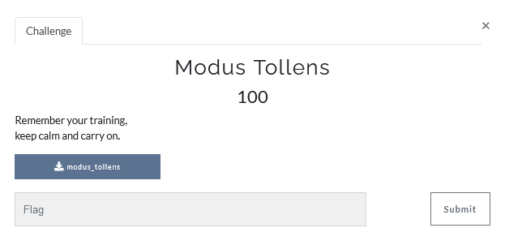
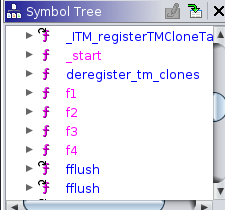

# Modus Tollens




Lets check file type:
```console
matan@matan:~/Documents/hacking/matrix2021$ file modus_tollens 
modus_tollens: ELF 64-bit LSB shared object, x86-64, version 1 (SYSV), dynamically linked, interpreter /lib64/ld-linux-x86-64.so.2, BuildID[sha1]=54422473e87be37bd43c86d0549628a3912f14df, for GNU/Linux 3.2.0, not stripped
```

It's executable file let run it:
```console
matan@matan:~/Documents/hacking/matrix2021$ ./modus_tollens 
Enter flag: abc123  
Checking ...
Wrong! try again...
```

Check for strings:
```
matan@matan:~/Documents/hacking/matrix2021$ strings modus_tollens 
/lib64/ld-linux-x86-64.so.2
TB$s
mgUa
libc.so.6
.
.
.
Enter flag: 
Checking 
Sucess!
Wrong! try again...
```

Nothing special let open the file in ghidra an take a look on main function:
```c
printf("Enter flag: ");
uStack160 = 0x101324;
fgets((char *)&local_98,0x80,stdin);
```  
and a lot of nested if statements that check some chars.
```c
if ((int)CONCAT71(extraout_var,bVar1) == 0) {
    uStack160 = 0x101402;
    bVar1 = f4(local_7d,6);
    if ((int)CONCAT71(extraout_var_00,bVar1) == 0) {
      uStack160 = 0x101420;
      bVar1 = f2(local_8d,5);
      if ((int)CONCAT71(extraout_var_01,bVar1) == 0) {
        uStack160 = 0x10143e;
        bVar1 = f2(local_92,0xd);
```

Let see how it look in the assembly
```asm

        001013d4 0f b6 45 90     MOVZX      EAX,byte ptr [RBP + local_78]
        001013d8 0f be c0        MOVSX      EAX,AL
        001013db be 0f 00        MOV        ESI,0xf
                 00 00
        001013e0 89 c7           MOV        EDI,EAX
        001013e2 e8 71 fe        CALL       f2                                               
                 ff ff
```
It looks the software take char from input buffer([RBP + local_78]) and some value(0xf) and send it to f2.
We can see some pattern in each "if" block.

After calling to f2 if the value is 0 than we print Wrong.
```
        001013e7 85 c0           TEST       EAX,EAX
        001013e9 0f 85 a3        JNZ        LAB_00101d92
                 09 00 00
                             LAB_00101d92                                    XREF[1]:     001013e9(j)  
        00101d92 90              NOP
        00101d93 e9 84 01        JMP        LAB_00101f1c
                 00 00
        00101f1c 48 8d 3d        LEA        RDI,[s_Wrong!_try_again..._00102025]             = "Wrong! try again..."
                 02 01 00 00
        00101f23 e8 a8 f1        CALL       puts                                             int puts(char * __s)
                 ff ff
```

Let take a look on the validate functions and reverse them:


#### func f1 - check if the 4 left 4 bits of param_1 is not equal to param_2
```c
bool f1(char param_1,byte param_2)
{
  return (param_1 >> 4 & 0xfU) != param_2;
}
```
#### func f2 - check if the right 4 bits of param_1(char size) is not equal to param_2
```c
bool f2(byte param_1,byte param_2)
{
  return (param_1 & 0xf) != param_2;
}
```
#### func f3 - bit flip(not) param_1 and check if the 4 left 4 bits of param_1 is not equal to param_2
```c
bool f3(byte param_1,byte param_2)
```
{
  return ((char)~param_1 >> 4 & 0xfU) != param_2;
}
#### func f4 -bit flip(not) param_1 and check if the 4 right 4 bits of param_1 is not equal to param_2
```c
bool f4(byte param_1,byte param_2)
{
  return (~param_1 & 0xf) != param_2;
}
```

So now we know that every if  take char from buffer and then validate it with one of the four function.
We can build a reverse script that will find the flag but some info is missing like:
 1.Length of the pass.
 2.map for each "if" action,call and their params.

I will start from the end
#### build map
disassembly file (objdump -d -M intel) and filter only this 3 commands that repeated as part of the if statements.
```console
 #1
 0x00000000000013d4 <+250>:   0f b6 45 90     movzx  eax,BYTE PTR [rbp-0x70]
 0x00000000000013db <+257>:   be 0f 00 00 00  mov    esi,0xf
 0x00000000000013e2 <+264>:   e8 71 fe ff ff  call   0x1258 <f2>
 #2
 0x00000000000013ef <+277>:   0f b6 45 8b     movzx  eax,BYTE PTR [rbp-0x75]
 0x00000000000013f6 <+284>:   be 06 00 00 00  mov    esi,0x6
 0x00000000000013fd <+291>:   e8 ad fe ff ff  call   0x12af <f4>
```

Now i can create the map in following structure:
```python
{char_index:[[val,validate_function]]}
#Example
#{11: [[15, f2],[10, f2]]}
```
I build the following script to map all the data
```python
from collections import defaultdict
import pprint
import string

#validate functions
def f1(c1, c2):
    return (c1 >> 4 & 0xf) != c2
def f2(c1, c2):
    return (c1 & 0xf) != c2
def f3(c1, c2):
    return ((~ c1) >> 4 & 0xf) != c2
def f4(c1, c2):
    return ((~ c1) & 0xf) != c2
d = defaultdict(lambda: [])
with open("cmds.txt", 'r') as f:
    while True:
        try:
            addr = f.readline().split('-')[1].split(']')[0]
            addr = int(addr, 16) - 0x65
            dst = f.readline().split(',')[1].strip()
            f_name = f.readline().split('<')[2].split('>')[0]
            d[addr].append([int(dst, 16), locals()[f_name]])
        except:
            break
 print("f lenght of password {len(d.items()}")
```

now we know what is the length and we have all the calls and their params and every index has 2 function calls.
next action we need to build some brute-force script to build the flag by using the validate functions

```python
password = [None] * 44
t=0
for k, v in d.items():
    for c in string.printable:
        if d[k][0][1](ord(c), d[k][0][0]) == False and d[k][1][1](ord(c), d[k][1][0]) == False:
            password[k] = c
            t+=1
password = "".join(password)[::-1]
print(f"flag:{password}")
```

After running all parts together you will get the flag

#### MCL{S0m3##############################}


 


