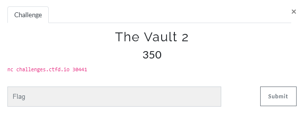

# Vault2



  ```console
   _____  _              __     __               _  _              ____  
|_   _|| |__    ___    \ \   / /  __ _  _   _ | || |_           |___ \ 
  | |  | '_ \  / _ \    \ \ / /  / _` || | | || || __|  _____     __) |
  | |  | | | ||  __/     \ V /  | (_| || |_| || || |_  |_____|   / __/ 
  |_|  |_| |_| \___|      \_/    \__,_| \__,_||_| \__|          |_____|
                                                                       
 ____  ____  ____  ____  ____  ____  ____ 
||A ||||B ||||C ||||D ||||E ||||F ||||G ||
||__||||__||||__||||__||||__||||__||||__||
|/__\||/__\||/__\||/__\||/__\||/__\||/__\|
 ____  ____  ____  ____  ____  ____  ____ 
||H ||||I ||||J ||||K ||||L ||||M ||||N ||
||__||||__||||__||||__||||__||||__||||__||
|/__\||/__\||/__\||/__\||/__\||/__\||/__\|
 ____  ____  ____  ____  ____  ____  ____ 
||O ||||P ||||Q ||||R ||||S ||||T ||||U ||
||__||||__||||__||||__||||__||||__||||__||
|/__\||/__\||/__\||/__\||/__\||/__\||/__\|
 ____  ____  ____  ____  ____  ____  ____ 
||* ||||V ||||W ||||X ||||Y ||||Z ||||# ||
||__||||__||||__||||__||||__||||__||||__||
|/__\||/__\||/__\||/__\||/__\||/__\||/__\|


Welcome Agent, we need your help to open a Secure Vault.
This time, More Twisted Vault !!!
We managed to intercept some of the encryption method of the vault.
Be aware, You have one time chance to submit the password
Good luck !!!

*************** Main Menu ***************
*                                       *
*  [ 1 ] ---- Encrypt a Letter          *
*  [ 2 ] ---- Print Encrypted Password  *
*  [ 3 ] ---- Submit Password           *
*  [-1 ] ---- Quit                      *
*                                       *
*****************************************
```
lets check option 1
```console
Enter input:
1
Please enter a letter to encrypt
A
Your encrypted letter is: I
Based on: 2129145000
Enter input:
1
Please enter a letter to encrypt
A
Your encrypted letter is: O
Based on: 1820221898
```
  looks like the encryption  based on input_char and random number

i found Formula to get the encrypted  char `(base_num + input_char  - 0x41) % 26 + 0x41`

If i will found how the base_number generated maybe i will know how to predict what is the next number.
based on hint from vault 1  `"According to our intelligence the password is 624 digits long."` i google and found this link - https://en.wikipedia.org/wiki/Mersenne_Twister

based on link above i found how to predict random number - https://github.com/kmyk/mersenne-twister-predictor

script  to predict the next number - 
```python
import socket
import pprint
from mt19937predictor import MT19937Predictor

TCP_IP = 'challenges.ctfd.io'
TCP_PORT = 30441
BUFFER_SIZE = 2048
MESSAGE = "1\n"
PASSWORD = "2\n"
op = "A\n"

def get_base_number(my_socket):
    my_socket.send(MESSAGE.encode())
    data = my_socket.recv(BUFFER_SIZE)
    my_socket.send(op.encode())
    data = my_socket.recv(BUFFER_SIZE).decode()
    return int(data.split("\n")[1].split(': ')[-1])

predictor = MT19937Predictor()
s = socket.socket(socket.AF_INET, socket.SOCK_STREAM)
s.connect((TCP_IP, TCP_PORT))
data = s.recv(BUFFER_SIZE)
res = []
for i in range(624):
    num = get_base_number(s)
    res.append(num)
    predictor.setrandbits(num, 32)
print("next_number:{predictor.getrandbits(32)})
```


now we need to add decrypt function in order to decrypt the password
```python
def decrypt_char(base_num, char):
    for c in"ABCDEFGHIJKLMNOPQRSTUVWXYZ":
        if ((base_num + ord(c) - 0x41) % 26 + 0x41) == char:
            return c
    return '#'
```

now lets put all parts together  + get the password

https://gist.github.com/matanr1/76199549deef75a40e5f5e865e837ea5

```python
import socket
import pprint
from mt19937predictor import MT19937Predictor

TCP_IP = 'challenges.ctfd.io'
TCP_PORT = 30441
BUFFER_SIZE = 2048
MESSAGE = "1\n"
PASSWORD = "2\n"
op = "A\n"


def decrypt_char(base_num, char):
    for c in "ABCDEFGHIJKLMNOPQRSTUVWXYZ":
        if ((base_num + ord(c) - 0x41) % 26 + 0x41) == char:
            return c
    return '#'


def get_base_number(my_socket):
    my_socket.send(MESSAGE.encode())
    my_socket.recv(BUFFER_SIZE)
    my_socket.send(op.encode())
    data = my_socket.recv(BUFFER_SIZE).decode()
    return int(data.split("\n")[1].split(': ')[-1])


def exploit():
    predictor = MT19937Predictor()
    s = socket.socket(socket.AF_INET, socket.SOCK_STREAM)
    s.connect((TCP_IP, TCP_PORT))
    s.recv(BUFFER_SIZE)
    res = []
    for i in range(624):
        num = get_base_number(s)
        res.append(num)
        predictor.setrandbits(num, 32)

    s.send(PASSWORD.encode())
    data = s.recv(BUFFER_SIZE)
    pot_pass = data.decode().split(": ")[1].split('\n')[0]
    decrypt_pass = ""
    for ch in pot_pass:
        decrypt_pass += decrypt_char(predictor.getrandbits(32), ord(ch))
    s.close()
    pprint.pp(f"flag - {decrypt_pass}")


if __name__ == '__main__':
    exploit()
```

result:
### flag - SEEMSLIKEYOUUNTWISTEDTHEMERSENNETWISTERPRNGALGOIRTHM


